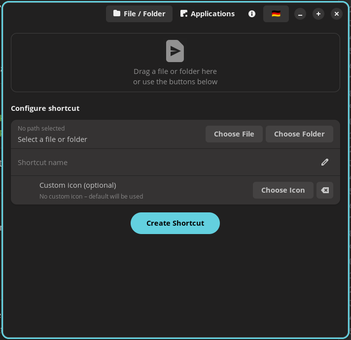

# 🔗 Desktop Linker

**Create desktop shortcuts on Linux – the easy way.**

Desktop Linker lets you create shortcuts for files, folders and installed applications directly on your Linux desktop. No terminal needed, no manual editing of `.desktop` files.

> Designed for Windows switchers and anyone who just wants a simple way to put things on their desktop.



---

## ✨ Features

- 📁 **Files & Folders** – Drag & drop or use the file dialog
- 🖥️ **Applications** – Browse all installed apps with search
- 🎨 **Custom Icons** – Optional custom icon for any shortcut
- 🌍 **English & German** – Auto-detects system language, switchable at runtime
- 📦 **Works everywhere** – Compatible with GNOME, KDE, XFCE, COSMIC and more

---

## 📦 Installation

### Option 1 – .deb package (Ubuntu, Pop!_OS, Debian, Mint, ...)

Download the latest `.deb` from the [Releases](https://github.com/MaKom70/desktop-linker/releases) page and install it:

```bash
sudo apt install ./desktop-linker_1.0.0_all.deb
```

Or just double-click the `.deb` file in your file manager.

### Option 2 – Flatpak (all distributions)

```bash
flatpak install flathub io.github.desktoplinker
```

> Flatpak not installed? See [flatpak.org/setup](https://flatpak.org/setup/)

### Option 3 – Manual installation (all distributions)

**Install dependencies first:**

| Distribution | Command |
|---|---|
| Ubuntu / Pop!_OS / Debian / Mint | `sudo apt install python3-gi gir1.2-gtk-4.0 gir1.2-adw-1 xdg-utils` |
| Fedora | `sudo dnf install python3-gobject gtk4 libadwaita xdg-utils` |
| Arch / Manjaro | `sudo pacman -S python-gobject gtk4 libadwaita xdg-utils` |
| openSUSE | `sudo zypper install python3-gobject typelib-1_0-Gtk-4_0 typelib-1_0-Adw-1 xdg-utils` |

**Then run the install script:**

```bash
git clone https://github.com/MaKom70/desktop-linker.git
cd desktop-linker
chmod +x install.sh
./install.sh
```

The install script automatically detects your package manager and installs any missing dependencies.

---

## 🚀 Usage

Launch **Desktop Linker** from your application menu.

### Files & Folders tab
1. Drag a file or folder into the drop zone **or** click *Choose File* / *Choose Folder*
2. Optionally change the shortcut name
3. Optionally choose a custom icon
4. Click **Create Shortcut**

### Applications tab
1. Browse or search the list of installed apps
2. Select an app
3. Optionally change the name or choose a custom icon
4. Click **Create App Shortcut**

### Language
Click the 🇩🇪 / 🇬🇧 flag button in the top-right corner to switch between English and German at any time.

---

## 🖥️ Requirements

- Linux with a freedesktop-compatible desktop environment
- Python 3.8 or newer
- GTK 4
- libadwaita
- xdg-utils

---

## 🔧 Building the .deb package yourself

```bash
git clone https://github.com/MaKom70/desktop-linker.git
cd desktop-linker
chmod +x packaging/build-deb.sh
./packaging/build-deb.sh
```

This produces `desktop-linker_VERSION_all.deb` in the current directory.

---

## 🤝 Contributing

Contributions are welcome! If you find a bug or have an idea for a new feature:

1. [Open an issue](https://github.com/MaKom70/desktop-linker/issues)
2. Or fork the repo and submit a pull request

### Adding a new language

All strings are in the `TRANSLATIONS` dict at the top of `desktop_linker.py`. To add a new language, copy the `"en"` block, change the key to your language code (e.g. `"fr"`) and translate the strings. Then add your language code to the `detect_language()` function.

---

## 📄 License

MIT License – see [LICENSE](LICENSE) for details.

---

## 🙏 Acknowledgements

- Built with [GTK 4](https://gtk.org/) and [libadwaita](https://gnome.pages.gitlab.gnome.org/libadwaita/)
- Inspired by the lack of a simple desktop shortcut tool for the [COSMIC desktop](https://system76.com/cosmic)
